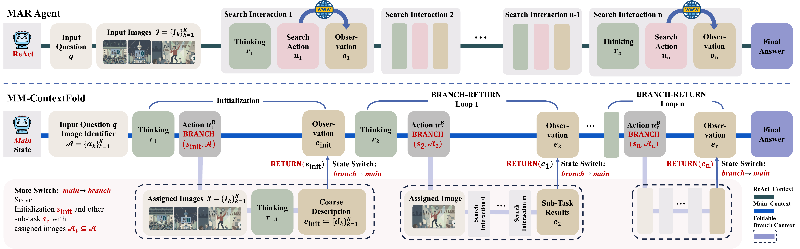

# MM-ContextFold: Context Folding for Multimodal Agentic Retrieval

> **[ACM MM 2026]** A training-free dual-state context management framework that decouples visual grounding from the main reasoning trajectory in Multimodal Agentic Retrieval.

## Authors

**Yang Tian**<sup>1</sup>\*, **Fan Liu**<sup>2</sup>†, **Jingyuan Zhang**<sup>3</sup>, **Zhenyang Li**<sup>4</sup>, **Yupeng Hu**<sup>1</sup>, **Liqiang Nie**<sup>5</sup>†

<sup>1</sup> Shandong University  
<sup>2</sup> Southeast University  
<sup>3</sup> Kuaishou  
<sup>4</sup> Hong Kong University of Science and Technology  
<sup>5</sup> Harbin Institute of Technology, Shenzhen  
\* Work done during an internship at Kuaishou.  
† Corresponding authors

## Links

- **Paper**: [`ArXiv`]([https://doi.org/10.1145/3767308.3836039](https://arxiv.org/pdf/2609.23121))
- **Code Repository**: [`GitHub`](https://github.com/iLearn-Lab/MM26-MMContextFold)
- **Dataset**: [`GitHub`](https://github.com/iLearn-Lab/MM26-MMContextFold/tree/main/dataset)
---

## Table of Contents

- [Updates](#updates)
- [Introduction](#introduction)
- [Highlights](#highlights)
- [Method / Framework](#method--framework)
- [Project Structure](#project-structure)
- [Installation](#installation)
- [Dataset / Benchmark](#dataset--benchmark)
- [Usage](#usage)
- [Results](#results)
- [TODO](#todo)
- [Citation](#citation)
- [Acknowledgement](#acknowledgement)
- [License](#license)

---

## Updates

- [08/2026] Release code and scripts
- [08/2026] MM-ContextFold is accepted by ACM Multimedia 2026
- [09/2026] Preprint version release on ArXiv 

---

## Introduction

Multimodal Agentic Retrieval (MAR) requires agents to iteratively invoke search tools over multimodal inputs across extended tool-use trajectories. Prevailing frameworks (e.g., ReAct) append raw input images and full interaction histories to a single ever-growing context, causing **context saturation**: raw images persist at every reasoning step and continuously exacerbate context inflation.

Through a systematic empirical study over approximately **10,000 retrieval trajectories**, we find that:

- The agent's reliance on raw images **progressively diminishes** as visual cues are extracted and textualized into the evolving context (97.8% of *Image Needed* reasoning steps are concentrated in the first five steps).
- Once grounding is largely complete, continued image retention is associated with **redundant visual context, higher output entropy, and neutral or worse downstream accuracy**.
- The duration of the visual-grounding phase **varies with task type**, precluding a fixed removal point.

Motivated by these findings, we propose **MM-ContextFold**, a training-free framework that decouples visual grounding from the main reasoning trajectory:

1. **Text-only main context** — a persistent state dedicated to high-level strategy planning over textual artifacts.
2. **Ephemeral branch contexts** — spawned on demand, loading only the designated raw images for scoped visual grounding and tool use.
3. **Branch-and-return** — each branch distills its findings into a textual summary folded back to the main context, after which the raw images and redundant traces are discarded.

This repository provides:
- The MM-ContextFold pipeline implementation (dual-state branch-and-return reasoning)
- Unified search tool interface (Text Retrieval / Visual Search / Web Visit)
- Seven MAR benchmarks in a unified JSONL format

---

## Highlights

- First systematic empirical characterization (~10,000 trajectories) of the dynamically diminishing reliance of MAR agents on raw images, combining reasoning-text annotation, stepwise entropy probes, and image-removal ablations
- **Training-free** dual-state context architecture: a persistent text-only main state for planning and ephemeral multimodal branch states for scoped visual grounding
- Modality-asymmetric branch-and-return: on-demand image loading, textual fold-back, and immediate release of raw images after grounding
- **+6.3%** average accuracy over the standard ReAct baseline across seven benchmarks and five backbones, while reducing working context length by **27.5%**

---

## Method / Framework

<p align="center">
  
</p>

*Top: the standard MAR framework, where raw input images persist in the context throughout the entire trajectory. Bottom: MM-ContextFold maintains a text-only main state that plans subtasks; the agent injects only the assigned images into an ephemeral branch state for visual grounding and tool use, and RETURN folds the branch result back as a textual summary, after which the branch context is discarded.*

MM-ContextFold instantiates three design principles:

- **P1 — Decoupled reasoning and grounding**: high-level textual planning and evidence synthesis are separated from visual grounding, reflecting their distinct cognitive roles.
- **P2 — Ephemeral visual context**: raw images are confined to scoped branch contexts instead of being retained persistently.
- **P3 — Adaptive image allocation**: the agent dynamically decides when and which images to load, accommodating varying visual demands across tasks.

The framework operates as a dual-state branch-and-return mechanism:

1. **Initialization** — Query images are registered with stable textual identifiers; an initialization cycle produces a coarse textual description per image as a planning prior in the main state.
2. **BRANCH** — When the agent determines that new cues need to be obtained from images, it spawns a branch state that injects only the assigned subset of images and executes visual-grounding tool calls (Visual Search, Text Retrieval, Web Visit) within the scoped branch context.
3. **RETURN** — The branch folds the gathered multimodal evidence into a structured textual summary fed back to the main state; the ephemeral branch trajectory is then discarded.
4. **Iterative reasoning** — The text-only main state alternates planning and BRANCH/RETURN cycles until it outputs the final answer.

---

## Project Structure

```text
.
├── assets/
│   ├── framework.png                     # Framework overview figure
│   └── framework.pdf                     # Vector version of the figure
├── mmcontextfold/
│   ├── run.py                            # Pipeline runner (entry point)
│   ├── configs/
│   │   ├── base.yaml                     # Dataset & model configurations
│   │   └── api_keys.py                   # API key management (via env vars)
│   ├── pipelines/
│   │   ├── base_pipeline.py              # Base pipeline abstraction
│   │   └── pipeline_mmcontextfold.py     # MM-ContextFold dual-state pipeline
│   ├── prompts/
│   │   └── prompts_mmcontextfold.py      # Prompt templates
│   └── utils/
│       ├── search_tools.py               # Text Search / Visual Search / Web Visit tools
│       └── search_backbone_model.py      # OpenRouter chat client
├── dataset/                              # Seven MAR benchmarks (unified JSONL format)
│   ├── mmsearch_plus/
│   ├── mmsearch/
│   ├── world_vqa/
│   ├── vdr_bench/
│   ├── simplevqa/
│   ├── livevqa/
│   └── browsecomp_vl/
└── Readme.md
```

---

## Installation

### 1. Clone the repository

```bash
git clone https://github.com/iLearn-Lab/MM26-MMContextFold.git
cd MM26-MMContextFold
```

### 2. Create environment

```bash
conda create -n mmcontextfold python=3.10
conda activate mmcontextfold
```

### 3. Install dependencies

```bash
pip install openai requests pyyaml pillow
```

### 4. Configure API keys

The pipeline calls backbone models via [OpenRouter](https://openrouter.ai/), performs Text/Visual Search via the [Serper API](https://serper.dev/), and reads web pages via [Jina Reader](https://jina.ai/reader/). Set the keys as environment variables:

```bash
export OPENROUTER_API_KEY="your_openrouter_key"
export SERPER_API_KEY="your_serper_key"
export JINA_API_KEY="your_jina_key"
```

---

## Dataset / Benchmark

We evaluate on seven multimodal agentic retrieval benchmarks (1,727 samples in total), grouped into three categories by their requirements for external knowledge retrieval and reasoning complexity:

| Category | Benchmark | #Samples | Characteristics |
|---|---|:---:|---|
| Atomic factuality | SimpleVQA | 300 | Recognize entities in images and retrieve encyclopedic knowledge |
| Atomic factuality | WorldVQA | 200 | Long-tail entity grounding with tail-knowledge retrieval |
| Dynamic information-seeking | MMSearch | 171 | Recent events requiring fresh or specialized web information |
| Dynamic information-seeking | LiveVQA | 245 | Time-sensitive or domain-specific queries with active verification |
| Visual deep research | BrowseComp-VL | 300 | Visually ambiguous referents requiring chained retrieval |
| Visual deep research | MMSearch-Plus | 311 | Multi-image queries (up to 5 images) with clues distributed across images |
| Visual deep research | VDR-Bench | 200 | Fine-grained cues supporting long multi-step reasoning chains |

Each dataset uses a unified JSONL format (`data_unified.jsonl`):

```json
{
  "id": "sample_001",
  "query": "What is shown in the image?",
  "query_images": ["image_001.png"],
  "answer": "ground truth answer"
}
```

Due to licensing restrictions, the actual data files are not included in this repository. Please refer to [dataset/README.md](./dataset/README.md) for the data format, directory structure, and instructions on obtaining the original datasets.

---

## Usage

All commands are run from the `mmcontextfold/` directory:

```bash
cd mmcontextfold
```

### Run MM-ContextFold

**Single sample:**

```bash
python run.py --method mmcontextfold --dataset mmsearch_plus --index 0
```

**A range of samples:**

```bash
python run.py --method mmcontextfold --dataset mmsearch_plus --start 0 --end 100
```

**Full dataset:**

```bash
python run.py --method mmcontextfold --dataset mmsearch_plus --all
```

### Options

| Argument | Default | Description |
|---|---|---|
| `--method` | `mmcontextfold` | Pipeline method (see `--list-methods`) |
| `--dataset` | `mmsearch_plus` | One of `mmsearch_plus`, `mmsearch`, `world_vqa`, `vdr_bench`, `simplevqa`, `livevqa`, `browsecomp_vl` |
| `--model` | `gemini-2.5-flash` | Backbone model (configured in `configs/base.yaml`, served via OpenRouter) |
| `--max-rounds` | `15` | Maximum interaction rounds |
| `--output-dir` | auto | Custom output directory |

To list all registered pipeline methods:

```bash
python run.py --list-methods
```

### Tools

The branch state exposes four actions, all routed through the same backend APIs across methods:

| Tool | Backend | Description |
|---|---|---|
| `search` | Serper API | Google web search; returns top-10 results with titles, snippets, and URLs |
| `lens_search` | Serper (Google Lens) | Reverse image search on a registered query image identifier |
| `visit` | Jina Reader | Fetch and parse the content of a specified webpage |
| `return` | — | Fold the branch findings back to the main state as a textual summary |

### Key Hyperparameters

| Hyperparameter | Value |
|---|---|
| Temperature / Top-p | 0.2 / 0.95 |
| Max total LLM calls (T<sub>max</sub>) | 20 |
| Max branch steps (B<sub>max</sub>) | 5 |
| Top-k web results | 10 |
| Independent trials | 3 |

### Evaluation

Answer correctness is determined by a fixed LLM-as-Judge protocol (Gemini-3-Flash) that follows the SimpleQA / HLE two-step *extract-then-grade* template: the judge extracts the core factual claim from the model response and grades it against the gold answer as `CORRECT` / `INCORRECT` / `NOT_ATTEMPTED`. The same judge model and prompt are used for all methods and backbones.

---

## Results

### Main Results (weighted average accuracy, %)

All methods use the same tool set and the same inference budget of up to 20 LLM calls, averaged over three independent trials on seven benchmarks:

| Backbone | Direct | ReAct | AgentFold | ContextFold | **MM-ContextFold (Ours)** |
|---|:---:|:---:|:---:|:---:|:---:|
| Gemini-3-Flash | 47.5 | 57.6 | 55.4 | 57.7 | **63.2** |
| GPT-5.2 | 41.1 | 56.0 | 52.8 | 55.2 | **61.1** |
| Qwen3.5-9B | 26.2 | 44.9 | 44.3 | 47.5 | **53.4** |
| Qwen3.5-27B | 30.6 | 54.8 | 49.9 | 53.9 | **60.3** |
| Qwen3.5-35B-A3B | 31.7 | 51.1 | 47.2 | 51.0 | **58.1** |
| *Average* | 35.4 | 52.9 | 49.9 | 53.1 | **59.2** |

MM-ContextFold achieves the highest weighted average for every backbone, with gains of **+6.3%** over ReAct, **+6.1%** over ContextFold, and **+9.3%** over AgentFold. Improvements are most pronounced on the three *Visual deep research* benchmarks (**+8.2%** over the strongest baseline).


---

## TODO

- [ ] Add dataset download links
- [ ] Release evaluation scripts (LLM-as-Judge protocol)
- [ ] Support more backbone models

---

## Citation

If you find this work helpful, please cite our paper:

```bibtex
@inproceedings{tian2026mmcontextfold,
  title={MM-ContextFold: Context Folding for Multimodal Agentic Retrieval},
  author={Tian, Yang and Liu, Fan and Zhang, Jingyuan and Li, Zhenyang and Hu, Yupeng and Nie, Liqiang},
  booktitle={Proceedings of the 34th ACM International Conference on Multimedia (MM '26)},
  year={2026},
  address={Rio de Janeiro, Brazil},
  doi={10.1145/3767308.3836039}
}
```

---

## Acknowledgement

- [OpenRouter](https://openrouter.ai/) for unified backbone model access
- [Serper](https://serper.dev/) for text and visual (Google Lens) search APIs
- [Jina Reader](https://jina.ai/reader/) for web page parsing
- [AgentFold](https://arxiv.org/abs/2510.24699) and ContextFold for context-management baselines
- [MMSearch](https://mmsearch.github.io/), MMSearch-Plus, [SimpleVQA](https://arxiv.org/abs/2502.13059), WorldVQA, [LiveVQA](https://arxiv.org/abs/2504.05288), BrowseComp-VL, and VDR-Bench for benchmark datasets

---

## License

This project is released under the Apache License 2.0.
